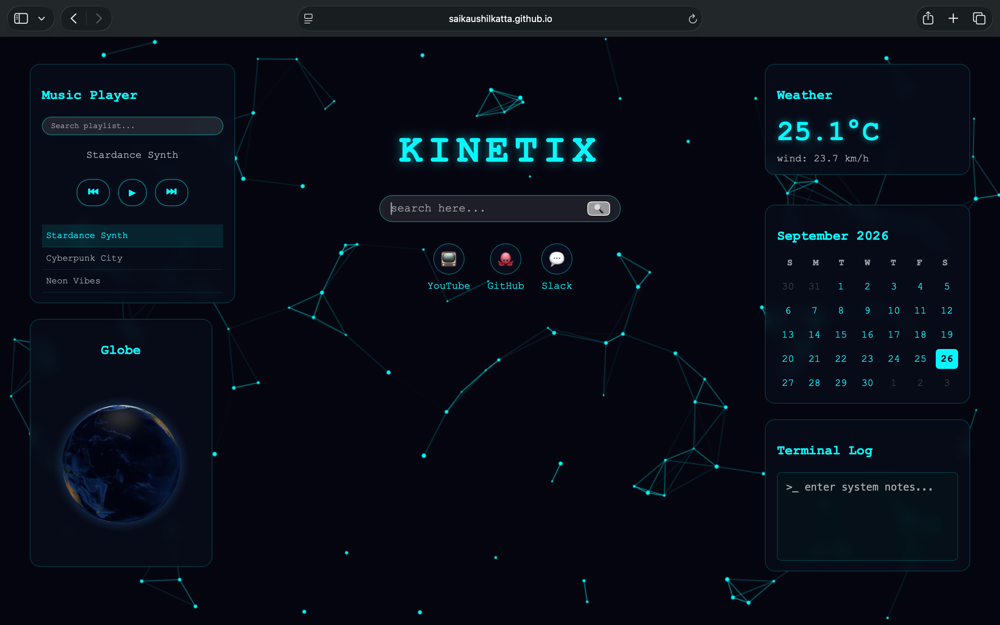

# kinetix 

A personal tab and dashboard I built for the Stardance challenge.

# Features

* A search engine (works with the help of google search engine).
* Three shortcuts for YouTube, Github and Slack.
* Weather widget (indicates temperature and wind speed on the basis of our location).
* A calendar (tells date, month and year).
* Terminal Log (we can write our tab notes in it).
* Music Player (plays three different songs).
* Globe (shows our earth rotating).
* It has an interactive background made with javascript.

# Live Demo

https://saikaushilkatta.github.io/pulse-new-tab/

# How to Run Locally

1. Clone the repository: `git clone https://github.com/saikaushilkatta/pulse-new-tab.git`
2. Open 'index.html' in your browser. 

Built with HTML5, CSS3, and JavaScript.
